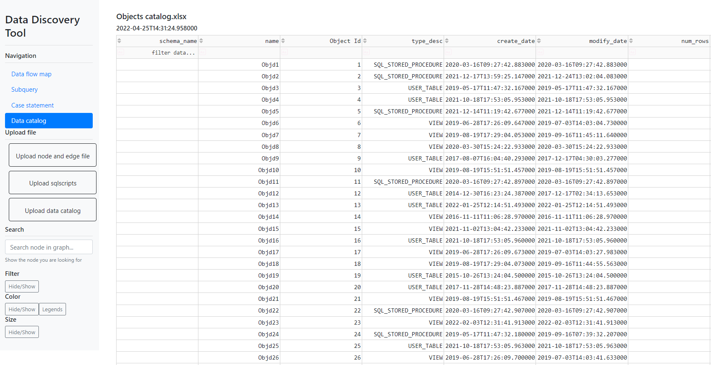

# Team-19

Team 19  Data Lineage
**Lecturer:**</br>
Dr Cruz Izu

**Client:**</br>
Dr Roberto Espinoza Valenzuela

**Members:**</br>
<pre>
      1. Zhaotong Cui     a1811379
      2. Mingen Xiao      a1788871
      3. Yufeng Jiang     a1809187
      4. Jing Han         a1835151
</pre>

## Data Discovery Tool
Data Discovery Tool is a tool for people to discover their data. It has four main pages: data flow map, subquery, case statement and data catalog.

## Install

```bash
git clone https://github.cs.adelaide.edu.au/MCI-projects-2022/Team-19.git
cd frontend/jaal
pip install -r requirements.txt
```

## Getting started

After installing the project, you could run the following command, then the console will prompt the default localhost address (`127.0.0.1:8050`) where you could see the project page.

```bash
python jaal_call.py
```

## Input File Format
To upload input files, please find the following buttons in the side bar located in the left hand side of the webpage:<br>
<br><br>
Before uploading the input files, please be careful and make sure that the input files are satisfied by the system. The following examples introduce the format features of the input files and show how they should look like:<br>
    - **Node File:** The node file needs to be a csv document. For the contents, the first row must be used to identify the type of the information of every object, and following by the detailed information of the objects line by line.<br>
<br><br>
    - **Edge File:** The edge file needs to be a csv document. For the contents, the first row must be used to identify the type of the information of every edge, and following by the detailed information of the objects line by line.<br>
<br><br>
    - **sql scripts:** The sql scripts needs to be a csv document.<br>
<br><br>
    - **Data Catalog:** The data catalog needs to be a xlsx document. For the contents, the first row must be used to identify the type of the information of every object, and following by the detailed information of the objects line by line. (The contents of the title can be various.)<br>
<br><br>

## Data Flow Map
By uploading nodes and edges, you could see the whole data flow map.<br>
At present, it has following functions:<br>
    - **Search:** can be used to find the node with linked edges in graph<br>
    - **Filter:** supports pandas query language and can be used to filter the graph data based on nodes or edge features.<br>
    - **Color:** can be used to color nodes or edges based on their categorical features. Note, currently only features with at max 20 cardinality are supported. <br>
    - **Size:** can be used to size nodes or edges based on their numerical features.<br>
    - **Detailed info:** When you hovering over the node, you can see some detailed information about the node.<br>


## Subquery
By uploading SQL scripts, you could see both the name and content of the subquery in a form of album. When the content of the subquery is too long, you can hovering over the box to see the full version.

## Case Statement
By uploading SQL scripts, you could see both the name and content of the case statement in a form of album. When the content of the case statement is too long, you can hovering over the box to see the full version.

## Data Catalog
By uplodaing the data catalog file, you could see the content of the data catalog. And you can also search the element based on attributes.
